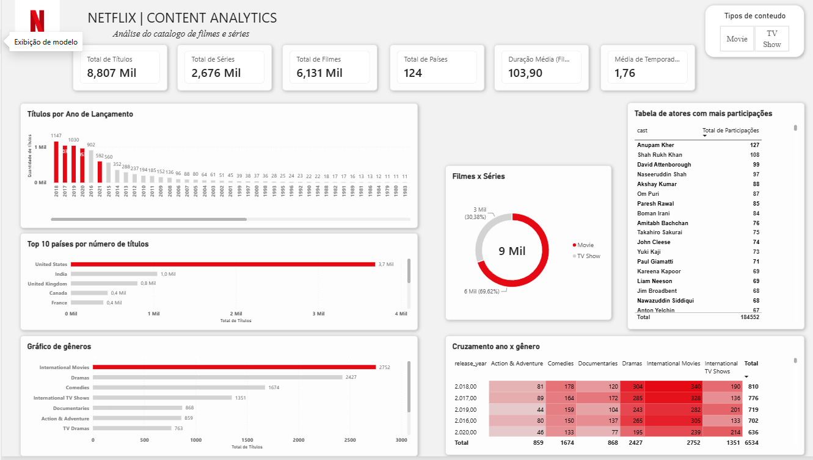

# Netflix Content Analytics 🎬

Projeto de portfólio de análise de dados usando o dataset público **Netflix Movies and TV Shows** (Kaggle), com tratamento em Python, armazenamento em SQLite e visualização em um dashboard interativo no Power BI.

Este projeto foi pensado como uma introdução prática ao fluxo completo de um projeto de dados: da exploração e limpeza até a entrega de um dashboard com storytelling visual.

---

## 🎯 Perguntas de negócio respondidas

1. ✅ Quantos títulos existem no catálogo?
2. ✅ Quantos são filmes e quantos são séries?
3. ✅ Como o catálogo cresceu ano a ano?
4. ✅ Quais países produzem mais conteúdo no catálogo?
5. ✅ Quais gêneros são mais comuns?
6. ✅ Qual é a classificação etária (rating) mais frequente?
7. ✅ Qual é a duração média dos filmes?
8. ✅ Qual é o número médio de temporadas das séries?
9. ✅ Existe relação entre o ano de lançamento e o gênero mais comum?

Todas as 9 perguntas do escopo original já estão respondidas no dashboard.

---

## 🗂️ Estrutura do projeto

```
├── dados/
│   ├── netflix.db                  # Banco SQLite com os dados tratados
│   └── netflix_titles_tratado.csv  # Dataset limpo, pronto para consumo no Power BI
├── cadernos/
│   └── exploracao.ipynb            # Exploração, limpeza e tratamento dos dados em Python
├── NETFLIX.pbix                    # Dashboard interativo no Power BI
├── .gitattributes
└── README.md
```

---

## 🛠️ Tecnologias utilizadas

- **Python (Pandas)** — exploração, limpeza e tratamento dos dados (`cadernos/exploracao.ipynb`)
- **SQLite** — armazenamento estruturado dos dados tratados (`dados/netflix.db`)
- **Power BI + Power Query + DAX** — modelagem, medidas calculadas e dashboard interativo (`NETFLIX.pbix`)

---
## 🧹 Tratamento de dados (Python)

O notebook `cadernos/exploracao.ipynb` cobre a exploração e limpeza antes dos dados irem para o SQLite/Power BI:

- **Nulos**: `director`, `cast` e `country` (até ~30% de valores ausentes) foram preenchidos com `"Não informado"` em vez de removidos, para não perder linhas.
- **Datas**: `date_added` convertida para tipo data com `errors="coerce"`, transformando datas mal formatadas em nulo em vez de quebrar o script.
- **Duração dividida em duas colunas**: `duration` misturava minutos (filme) e temporadas (série) na mesma coluna como texto. Foi separada em `duracao_minutos` (só filmes) e `temporadas` (só séries), permitindo calcular médias sem misturar as duas unidades.
- **Colunas auxiliares para colunas multivaloradas**: `country` e `listed_in` têm vários valores por célula — foram "explodidas" em tabelas auxiliares (`paises`, `generos`) para contar cada país/gênero individualmente, sem duplicar linhas na tabela principal.
- **Coluna derivada `ano_adicionado`**: extraída de `date_added`, usada para analisar a evolução do catálogo por ano.
- **Coluna derivada `defasagem_anos`**: diferença entre `ano_adicionado` e `release_year`. Foram encontrados casos de defasagem negativa (título "adicionado" antes do "ano de lançamento") — investigado e mantido, pois não é erro: `release_year` é o ano oficial dado pela produtora, que pode ser posterior à estreia real (ex: título estreado em dezembro já rotulado com o ano seguinte). Por isso a mediana (1 ano) foi usada em vez da média para descrever a defasagem típica, já que esses casos distorcem a média.
- Dados tratados exportados para `dados/netflix.db` (SQLite) e `dados/netflix_titles_tratado.csv`.

O notebook também inclui uma seção de **SQL básico com SQLite** (contagens, agrupamentos, filtros e ordenações) validando as mesmas perguntas de negócio antes delas irem para o Power BI.

## 📊 Sobre o dashboard


O dashboard (`NETFLIX.pbix`) foi construído com identidade visual inspirada na marca Netflix (preto, cinza e vermelho `#E50914`), e inclui:

- **Cartões de KPI**: Total de Títulos, Total de Filmes, Total de Séries, Total de Países, Duração Média (Filmes), Média de Temporadas (Séries)
- **Evolução do catálogo por ano**: gráfico de colunas com gradiente de cor destacando os anos mais recentes, tooltip customizado (ano, quantidade de títulos e variação % em relação ao ano anterior) e gridlines limpas
- **Distribuição Filmes x Séries**: gráfico de rosca (donut)
- **Total de Títulos por país**: gráfico de barras com o país líder destacado em vermelho
- **Principais gêneros**: gráfico de barras com o gênero líder destacado em vermelho
- **Classificação etária (rating) mais frequente**: gráfico de barras ordenado, com o rating líder destacado
- **Títulos por Ano e Gênero**: matriz em formato de mapa de calor (heatmap), cruzando `release_year` com os principais gêneros
- **Tabela de atores com mais participações**: top atores por número de aparições no catálogo, calculada a partir de uma tabela dedicada (`Atores`)
- Formatação visual consistente: fundo claro, cartões com sombra sutil e cantos arredondados

### Modelo de dados

Além da tabela principal `netflix_titles_tratado`, o modelo inclui duas tabelas de apoio, criadas por referência (sem alterar a tabela original) para permitir análises que dependem de colunas multivaloradas:

- **`Generos`** — `listed_in` dividido em uma linha por gênero (usada na matriz ano × gênero)
- **`Atores`** — `cast` dividido em uma linha por ator (usada na tabela de atores com mais participações)

> ⚠️ Colunas com múltiplos valores por célula (`listed_in`, `cast`) nunca devem ser divididas diretamente na tabela principal — isso duplica linhas e distorce todas as medidas de contagem/média. Sempre criar uma tabela de referência separada para esse tipo de tratamento.

### Medidas DAX principais

```dax
Total de Títulos = COUNTROWS(netflix_titles_tratado)

Total de Filmes = CALCULATE([Total de Títulos], netflix_titles_tratado[type] = "Movie")

Total de Séries = CALCULATE([Total de Títulos], netflix_titles_tratado[type] = "TV Show")

Duração Média (Filmes) = 
CALCULATE(AVERAGE(netflix_titles_tratado[duracao_minutos]), netflix_titles_tratado[type] = "Movie")

Média de Temporadas (Séries) = 
CALCULATE(AVERAGE(netflix_titles_tratado[temporadas]), netflix_titles_tratado[type] = "TV Show")

Var % Ano Anterior = 
VAR AnoAtual = SELECTEDVALUE(netflix_titles_tratado[release_year])
VAR TitulosAnoAnterior = 
    CALCULATE([Total de Títulos], FILTER(ALL(netflix_titles_tratado), netflix_titles_tratado[release_year] = AnoAtual - 1))
RETURN
DIVIDE([Total de Títulos] - TitulosAnoAnterior, TitulosAnoAnterior)

Total de Participações = COUNTROWS(Atores)
```

Também foram criadas medidas de formatação condicional (`Cor Coluna`, `Cor País`, `Cor Gênero`, `Cor Rating`) para destacar dinamicamente o item de maior valor em cada gráfico, com o mesmo padrão:

```dax
Cor Rating = 
VAR MaxTitulos = MAXX(ALLSELECTED(netflix_titles_tratado[rating]), CALCULATE([Total de Títulos]))
RETURN
IF([Total de Títulos] = MaxTitulos, "#E50914", "#D3D3D3")
```

### Nota sobre tratamento de dados (localidade)

Durante o desenvolvimento, foi identificado um problema de conversão de tipos no Power Query: colunas numéricas geradas em Python com casa decimal (ex: `90.0`, `1.0`) estavam sendo interpretadas com a localidade regional errada (Português-Brasil, que usa `.` como separador de milhar), corrompendo os valores (ex: `90.0` → `900`). A correção foi aplicar **Alterar Tipo → Usando a Localidade → Inglês (Estados Unidos)** logo na primeira conversão de tipo de cada coluna numérica derivada (`duracao_minutos`, `temporadas`, `ano_adicionado`, `defasagem_anos`, `release_year`), evitando reconversões duplicadas mais adiante na cadeia de etapas do Power Query.

---

## 🚀 Como reproduzir

1. Clone este repositório
2. Explore o tratamento dos dados em `cadernos/exploracao.ipynb`
3. Os dados tratados já estão disponíveis em `dados/netflix_titles_tratado.csv` e `dados/netflix.db`
4. Abra `NETFLIX.pbix` no Power BI Desktop para visualizar e interagir com o dashboard

## 📌 Status

Projeto funcionalmente completo — todas as 9 perguntas do escopo respondidas, com formatação visual e modelo de dados consolidados. Possíveis evoluções futuras: filtros estilizados como botões, rótulos de dados diretos nos gráficos de barra, e página de detalhamento adicional.

---

## 👤 Autor

**Caio Antunes**
Em transição de carreira para Análise de Dados / BI / Engenharia de Dados.
